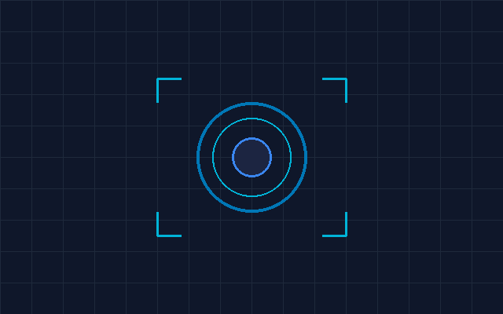

# FaceSecure - Portable Face Recognition Access Control System

**FaceSecure** is a modern, high-performance Windows desktop application designed for secure facial recognition access control, engineered to interface with an Arduino-based door lock mechanism.



---

## 🌟 Key Features & Highlights

- **Modern Dark Blue & White UI**: Clean, professional theme with soft glow accents, rounded corners, and sleek card containers.
- **Fixed Desktop Layout**: Optimized 1000 × 700 pixel non-resizable layout designed for dedicated access control control panels.
- **Modular Component Architecture**: Decoupled UI modules for Header, Sidebar, Live Camera Preview, System Status, Action Bar, and Status Bar.
- **System Metrics Panel**: Live status tracking for Camera state, Arduino connection, Door lock status, Registered Users, and Today's access logs.
- **Interactive Controls**: Toggle live camera preview modes, Arduino serial interfaces, face recognition loops, and navigation screens.

---

## 🛠️ Technology Stack

- **GUI Framework**: [CustomTkinter](https://github.com/TomSchimansky/CustomTkinter) (v6.0+)
- **Graphics & Imaging**: Pillow (PIL)
- **Language**: Python 3.12+
- **Planned Hardware / AI Integrations**:
  - **OpenCV** (`opencv-python`): Real-time RTSP/USB camera frame acquisition
  - **Face Recognition**: `face_recognition` / Deep learning embeddings
  - **Arduino / Hardware**: `pySerial` for relay door lock actuation via USB COM port

---

## 📂 Project Directory Structure

```
Door Lock System / FaceSecure/
│
├── assets/
│   ├── logo.png                # Application shield logo badge
│   └── camera_placeholder.png  # High-definition camera offline standby graphic
│
├── ui/
│   ├── __init__.py             # Package exports for UI components
│   ├── header.py               # Top header bar with logo, title, and status badge
│   ├── sidebar.py              # Left vertical navigation menu (Dashboard, Register, etc.)
│   ├── camera_preview.py       # Central camera viewport with standby/live feed graphics
│   ├── status_panel.py         # Right-side system metrics and status cards
│   ├── action_bar.py           # Bottom primary action buttons (Start Camera, Connect, etc.)
│   └── status_bar.py           # Footer status bar with dynamic message updates
│
├── styles.py                   # Centralized design tokens, color palette, and fonts
├── main.py                     # Main application entry point & layout window (1000x700)
└── README.md                   # Project documentation
```

---

## 🚀 Getting Started

### 1. Prerequisites

Make sure Python 3.10+ is installed on your system.

### 2. Installation

Install required dependencies:

```bash
pip install customtkinter pillow
```

### 3. Running the Application

Execute `main.py` from the root project directory:

```bash
python main.py
```

---

## 🎨 Theme & Color Palette

Defined in `styles.py`:

| Token | Color Code | Description |
| :--- | :--- | :--- |
| **Background Dark** | `#0B132B` | Main window deep navy background |
| **Card Background** | `#1C2541` | Primary component card background |
| **Primary Accent** | `#0077B6` | Electric blue buttons and highlights |
| **Secondary Accent**| `#3A86EF` | Vibrant secondary buttons |
| **Status Green** | `#06D6A0` | Live / Active / Unlocked status |
| **Status Red** | `#EF476F` | Offline / Locked / Disconnected status |
| **Text Primary** | `#FFFFFF` | Primary white text |

---

## 🔮 Future Expansion (Phase 2 Roadmap)

1. **OpenCV Integration**: Connect `cv2.VideoCapture(0)` to stream real-time frames directly into `CameraPreviewFrame`.
2. **Face Recognition Engine**: Encode facial landmars using OpenCV/dlib, match against sqlite database of registered faces, and calculate similarity scores.
3. **Arduino Relay Control**: Send `'1'` (Unlock) and `'0'` (Lock) serial signals over `pySerial` when authorized face matches are detected.
